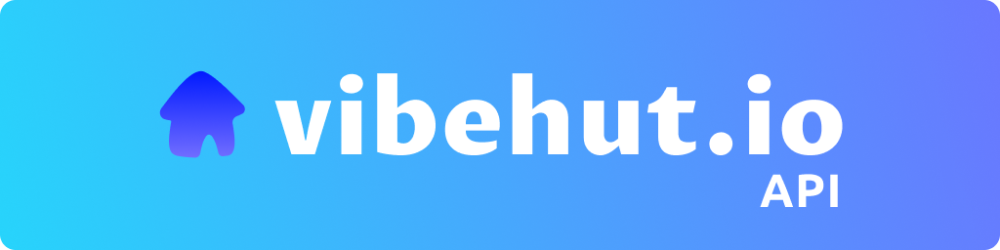

# Vibehut API

The Vibehut API provides RESTful endpoints for you to interact easily with Vibehut's data.. so you can help manage and accelerate the good vibes 💪

## Getting Started

1. Login to Vibehut using any popular social account
2. Generate authentication token
3. Start coding!

```js
const axios = require('axios');

const apiKey = [API KEY];
const url = 'https://vibehut.io/api/v1/public/events'; 
// or any endpont of your choosing!

const headers = {
  'api-key': `${apiKey}`
};

axios.get(url, { params, headers })
  .then(response => {
    console.log(JSON.stringify(response.data.data[0]));
  })
  .catch(error => {
    console.error(error);
  });
```

## Authentication

The Vibehut API uses token-based authentication. To authenticate requests, include the `api-key` header with a valid access token. 

To get a token 
1. Login to Vibehut
2. Account Settings (Click profile in bottom left)
3. API Key in the sidebar
4. Create


```js
const headers = {
  'api-key': `${apiKey}`
};

axios.get(url, { params, headers })
```

## Endpoints

### Endpoint Highlights

Getting you started is important. Here are some of our most popular endpoints. Please see the documentation below for a comprehensive list.

The root url is always `https://vibehut.io/api/v1/public/` so events is `https://vibehut.io/api/v1/public/events` 

`/events` - create, read, update events
- commonly used params: roomSlug, roomId, desoPublicKey
- filterBy [popular, upcoming, new]

Returns
```js
      _id: '64ade89038ce4c001462f23f',
      cover: [Object],
      isPaidEvent: false,
      price: 0,
      isPasswordProtected: false,
      title: 'Weekly Vibehut Platform Call',
      description: '',
      startDate: '2023-08-08T22:00:00.000Z',
      endDate: '2023-08-08T23:00:00.000Z',
      room: [Object],
      createdAt: '2023-07-11T23:41:04.416Z',
      rsvps: [Array],
      rsvp_count: 46,
      eventOwner: [Object],
      isAccessibleEvent: true
    }
```

`/calls` - create new instant call link

`/calls/active-calls` - see what calls are currently active

`/feed` - query the vibehut feed

`/notifications`- retrieve notifications

`/rooms` - create a room

## More Endpoints! See All API Documentation

The API documentation can be found [here](https://vibehut.notion.site/Vibehut-V1-Api-6f005655867747228cd5fef603f2ca45?pvs=4). It provides detailed information about each endpoint, including request and response examples.


## Contributing

Contributions are welcome! If you find any issues or have suggestions for improvements, please open an issue or submit a pull request.

## License

This project is licensed under the [MIT License](https://opensource.org/licenses/MIT).
